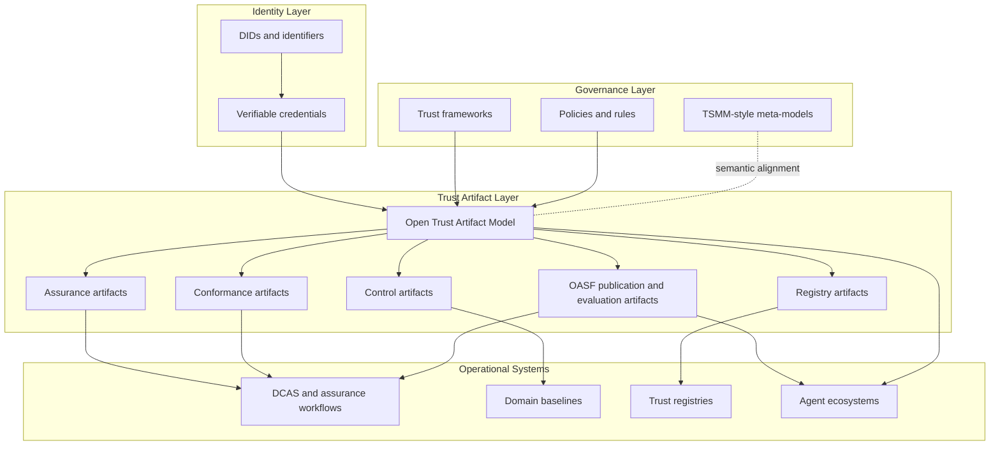

# Architecture snapshot

This diagram is a non-normative view of where this repository sits in a broader trust stack.

## Notes

- The repository is positioned as the machine-readable artifact layer between identity primitives and governance systems.
- Schemas in this repository are implementations of a broader artifact model.
- Downstream assurance, registry, and agent systems can reuse the same artifact classes without copying semantics into each repository.

- OASF publication profiles and evaluation envelopes now sit inside the trust artifact layer as shared carrier contracts between semantic models, domain baselines, evaluators, and registry surfaces.
