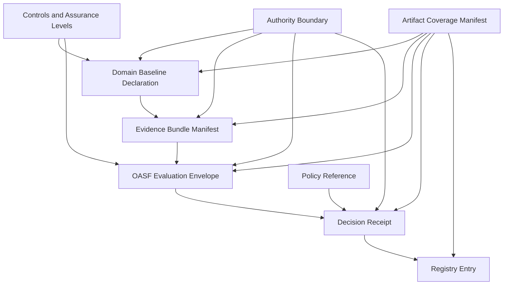

# Architecture

**Last reviewed:** 2026-05-05  
**Current release:** `v0.9.0`

The repository architecture is organized around artifact families that support executable governance.

## Architectural layers

| Layer | Files | Purpose |
|---|---|---|
| Identity and authority | `credentials/`, `profiles/ais1/`, `governance/` | Defines identity, profile, and authority-boundary contracts. |
| Assurance and conformance | `assurance/`, `conformance/`, `evidence/` | Defines claims, assurance levels, and evidence manifests. |
| Evaluation and policy | `oasf/`, `odrl/`, `decision/` | Defines publication, evaluation, policy reference, and decision artifacts. |
| Registry state | `registry/`, `examples/composition/` | Defines discoverable state and composition examples. |
| Model metadata | `model/`, `validation/` | Defines artifact taxonomy and validation coverage. |
| Tooling | `tools/`, `.github/workflows/` | Validates examples, schemas, diagrams, coverage, and release hygiene. |

## Design principles

- Prefer explicit artifact references over implicit trust.
- Preserve authority boundaries separately from identity claims.
- Keep domain policy outside generic schemas unless it is expressed as a reusable profile.
- Make all examples runnable through CI.
- Treat validation coverage as part of release evidence.
