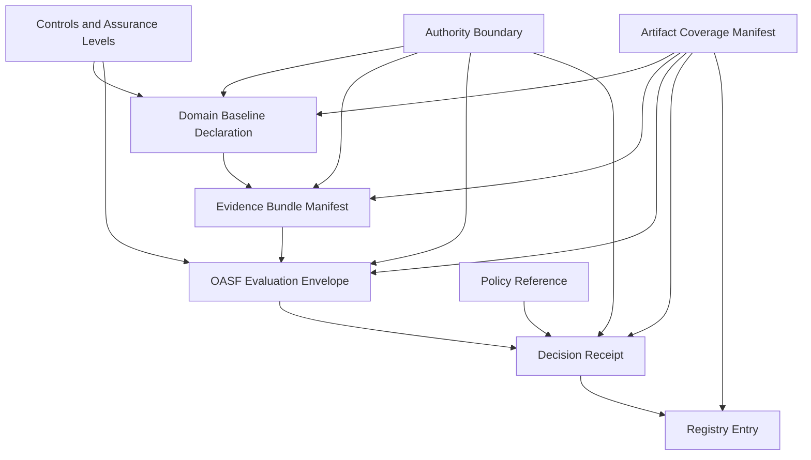

# Architecture

**Last reviewed:** 2026-08-20  
**Current release:** `v0.14.1`

The repository architecture is organized around artifact families that support executable governance.

```mermaid
flowchart TD
  A[Domain Baseline Declaration] --> B[Evidence Bundle Manifest]
  B --> C[OASF Evaluation Envelope]
  C --> D[Decision Receipt]
  D --> E[Registry Entry]
  F[Authority Boundary] --> A
  F --> B
  F --> C
  F --> D
  G[Controls and Assurance Levels] --> A
  G --> C
  H[Policy Reference] --> D
  I[Artifact Coverage Manifest] --> A
  I --> B
  I --> C
  I --> D
  I --> E
```

## Architectural layers

| Layer | Files | Purpose |
|---|---|---|
| Core authority | `governance/`, `delegation/`, `common/` | Portable authority, delegation, and reference contracts owned by TIS. |
| Ecosystem adapters | `credentials/`, `profiles/` | Compatibility overlays and mappings; upstream ecosystems remain authoritative for native semantics. |
| Assurance and conformance | `assurance/`, `conformance/`, `evidence/` | Defines claims, assurance levels, and evidence manifests. |
| Evaluation and policy | `oasf/`, `odrl/`, `decision/` | Defines publication, evaluation, policy reference, and decision artifacts. |
| Registry state | `registry/`, `examples/composition/` | Defines discoverable state and composition examples. |
| Model metadata | `model/`, `validation/` | Defines artifact taxonomy and validation coverage. |
| Tooling | `tools/`, `.github/workflows/` | Validates examples, schemas, diagrams, coverage, and release hygiene. |

## Authority topology

TIS distinguishes **core portable contracts** from **ecosystem adapters** and **repository assurance evidence**. Profiles do not acquire upstream semantic authority merely because TIS validates them. See [Repository Scope and Admission Policy]().

## Design principles

- Prefer explicit artifact references over implicit trust.
- Preserve authority boundaries separately from identity claims.
- Keep domain policy outside generic schemas unless it is expressed as a reusable profile.
- Make all examples runnable through CI.
- Treat validation coverage as part of release evidence.

## Flagship-layer responsibility

TIS is the portable machine-readable contract layer. TSMM remains authoritative for semantics, while TGA consumes TIS contracts in executable governance packages.
