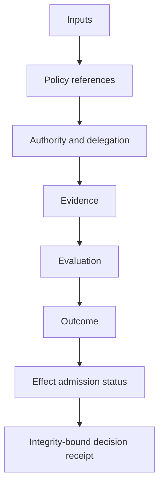

# Decision Receipts

**Last reviewed:** 2026-05-05  
**Introduced in:** `v0.7.0`

Decision receipts are the executable-governance bridge between published trust artifacts and operational reliance. They record the policy, evidence, authority boundary, decision maker, evaluated artifacts, and result associated with a trust decision.

## Why this artifact exists

Trust infrastructure often validates artifacts but loses the decision context that made the validation meaningful. A credential may be syntactically valid. A registry entry may be discoverable. An evaluation envelope may show that a control passed. None of those facts alone records whether a relying party was permitted to act, what policy was applied, or which conditions limited the action.

The decision receipt schema closes that gap. It makes reliance inspectable.

## What a receipt proves

A receipt can prove that:

- a specific subject was evaluated;
- a policy reference was used;
- specific artifacts were evaluated;
- an authority boundary constrained the decision;
- an assurance level or control set was considered;
- a result was issued at a specific time;
- conditions, allowed actions, and prohibited actions were recorded.

## What a receipt does not prove

A receipt does not prove universal trustworthiness. It does not replace live revocation checks. It does not grant runtime delegation unless the policy and evaluated artifacts explicitly do so. It should be interpreted as bounded evidence, not as a portable permission token.

## Schema location

- Schema: `decision/decision-receipt.schema.json`
- Example: `decision/examples/decision-receipt.example.json`

## Recommended verifier behavior

A verifier or relying party SHOULD:

1. validate the receipt against the schema;
2. check the `decision_type` and `result.status`;
3. inspect `policy_reference`;
4. verify each artifact listed in `evaluated_artifacts`;
5. check `authority_boundary` and `relying_party_constraints`;
6. verify timestamps and freshness constraints;
7. preserve the receipt with its evidence bundle for auditability.

## Assurance role

Decision receipts become especially important at AL3 and AL4 because they connect assurance claims to actual relying-party behavior. They provide evidence that governance was not merely published but operationally applied.

## Decision receipt generation

