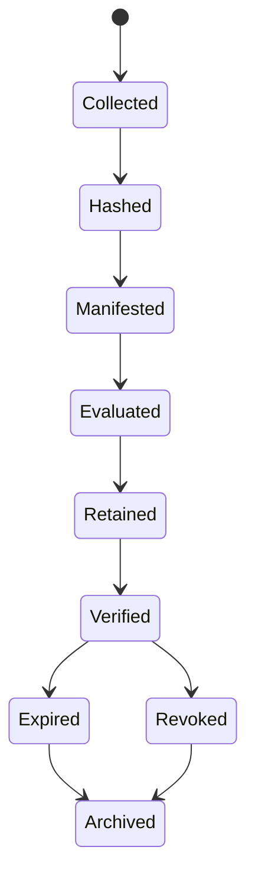

# Evidence Bundle Integrity Profile

## Purpose

The v0.10.0 evidence bundle integrity profile adds bundle-level tamper evidence. The evidence manifest can now carry canonicalization method, bundle digest, detached proof metadata, and signature references.

## Integrity block

The optional `integrity` block supports:

- canonicalization method, including JCS or JSON-LD canonicalization;
- bundle digest using SHA-256 or SHA-512;
- detached proof references;
- signature reference and verification method.

## Governance use

Evidence bundles may list individual artifact hashes, but runtime assurance requires the bundle itself to be bound. AL4 publication should prefer integrity-bound evidence bundles so auditors can verify the exact evidence set used for the decision.

## Validation

Schema: `evidence/evidence-bundle-manifest.schema.json`

Example: `evidence/examples/integrity-bound-evidence-bundle.example.json`

## Evidence bundle lifecycle

