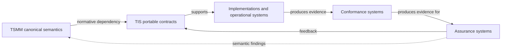

# Portfolio relationships

```mermaid
flowchart LR
  TSMM[TSMM canonical semantics] -->|normative dependency| TIS[TIS portable contracts]
  TIS -->|supports| IMPL[Implementations and operational systems]
  IMPL -->|produces evidence| CONF[Conformance systems]
  CONF -->|produces evidence for| ASSURE[Assurance systems]
  ASSURE -->|feedback| TIS
  ASSURE -. semantic findings .-> TSMM
```

TIS derives semantic meaning from TSMM while retaining independent authority over schema design, serialization, identifiers, releases, and validation contracts.
