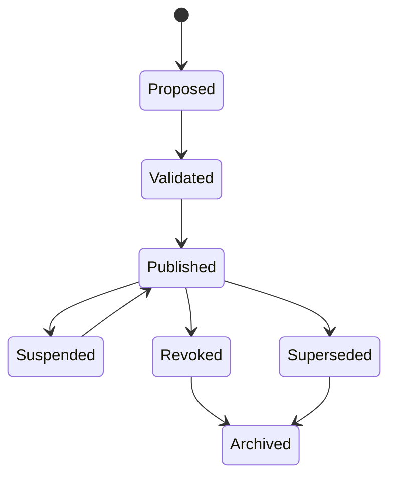

# Registry Publication Profile

## Purpose

The registry publication profile defines what evidence must accompany publication into a trust registry at each assurance level.

## Normative boundary

Registry publication is discovery evidence. It is not runtime authorization.

A registry publication profile MUST NOT be interpreted as runtime authorization unless linked to a current authority boundary, policy, evidence bundle, revocation/status check, and decision receipt.

## Assurance-level evidence

| Assurance level | Minimum publication evidence |
|---|---|
| AL1 | declaration reference |
| AL2 | declaration reference and evidence bundle |
| AL3 | declaration, evidence bundle, decision receipt, and authority boundary |
| AL4 | AL3 plus integrity-bound evidence bundle, status/revocation reference, and audit trail reference |

## Validation

Schema: `registry/registry-publication-profile.schema.json`

Example: `registry/examples/registry-publication-profile.example.json`

## Publication status lifecycle

